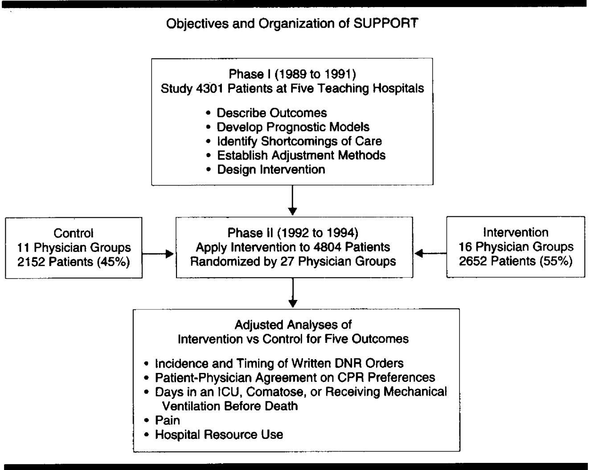
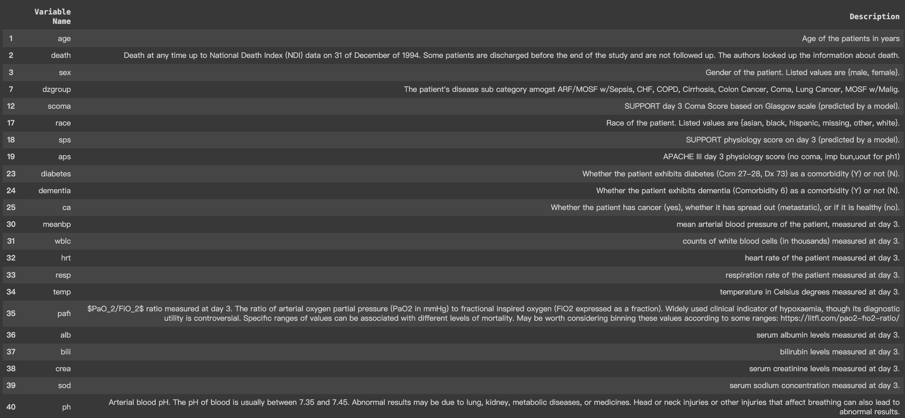

# CSE 151A Project

# Abstract about the course and our project

# Introduction 

This project aims to investigate and identify key factors that contribute to the diagnosis of specific diseases. Predicting the presence of various diseases based on a single factor is challenging; therefore, we have endeavored to predict them using multiple features available through machine learning techniques. This project will be carried out using the SUPPORT2 dataset from the UC Irvine Machine Learning Repository. This dataset comprises records of 9,105 critically ill patients from five United States medical centers, collected between 1989-1991 and 1992-1994, as illustrated by [Figure 1](#figure-1-support-project-phases). Each row contains the records of hospitalized patients who met the inclusion and exclusion criteria for one of eight disease categories: acute respiratory failure, chronic obstructive pulmonary disease, congestive heart failure, coma, colon cancer, lung cancer, multiple organ system failure with malignancy, and multiple organ system failure with sepsis. For disease prediction, we selected 21 features from this dataset, such as physiology scores, chemical levels, and various measurements on Day 3. [Table 1](#table-1-uci-dataset-features-detailed-information) presents the names and descriptions of these features. Machine Learning algorithms—logistic regression, neural networks, decision trees with XGBoost and Gradient Boosting, Support Vector Machines, and K-Nearest Neighbors—are employed, and we will later examine how our results fare in predicting these diseases based on the available data.


## Figure 1: SUPPORT Project Phases



*Figure 1.—Overall schematic presentation of phases I and II of the Study to Understand Prognoses and Preferences for Outcomes and Risks of Treatment (SUPPORT) project, 1989 to 1994. DNR indicates do not resuscitate; CPR, cardiopulmonary resuscitation; and ICU, intensive care unit.*


## Table 1: UCI Dataset Features Detailed Information



*Table 1.-UCI Dataset selected features descriptions.*


The rest of the paper is organized as follows: the Method Section will present the models we executed in the order we explored them. The Results Section will include findings from the aforementioned methods. The Discussion Section will present our interpretations, thought processes, and critiques from beginning to end. Finally, the Conclusion Section will offer our final thoughts.


# Methods: 
#### Data Preprocessing: 
  For data exploration, we called [pd.DataFrame()](https://colab.research.google.com/github/sebastian-dv/CSE-151A-Project/blob/main/SUPPORT2_Notebook.ipynb#scrollTo=RA1zgeeIgR2p&line=3&uniqifier=1) function to display the variable name and descriptions, and we found that there are 47 variables in total, which is a large dataset.
  Then we created a data frame using [read_csv](https://colab.research.google.com/github/sebastian-dv/CSE-151A-Project/blob/main/SUPPORT2_Notebook.ipynb#scrollTo=YC0o6IQ1i-ec&line=1&uniqifier=1), after transferring, we selected 21 features that we think worth to work with, they are: 'age','sex','dzgroup','scoma','race','sps','aps','diabetes','dementia','ca','meanbp','wblc','hrt','resp','temp','pafi','alb','bili','crea','sod','ph'
  The next step is checking for null. We used [df.isnull().sum()](https://colab.research.google.com/github/sebastian-dv/CSE-151A-Project/blob/main/SUPPORT2_Notebook.ipynb#scrollTo=KtldNNfpP723&line=1&uniqifier=1) function to calculate null value for each feature we selected.
  The result of df.isnull().sum() shows some features contain a bunch of null values, we are considering how to deal with this data, we will either completely remove them or refill them with mean/median data depending on the number of null values for that feature.
  For the features containing value type string, we applied [unique()](https://colab.research.google.com/github/sebastian-dv/CSE-151A-Project/blob/main/SUPPORT2_Notebook.ipynb#scrollTo=CpA9bV6xP9K9&line=1&uniqifier=1) function to make it easy to distinguish.
  For the binary feature like "sex", we divided them into integers 0 and 1 using the function :
[df['sex'].replace('female', 0, inplace=True)](https://colab.research.google.com/github/sebastian-dv/CSE-151A-Project/blob/main/SUPPORT2_Notebook.ipynb#scrollTo=89lDyDJ4QAdB&line=1&uniqifier=1)
  For nonbinary features, we applied [OneHotEncoder()](https://colab.research.google.com/github/sebastian-dv/CSE-151A-Project/blob/main/SUPPORT2_Notebook.ipynb#scrollTo=89lDyDJ4QAdB&line=4&uniqifier=1) function
  After the above data exploration and preprocessing, we are able to apply some visualization tools to help us explore the pattern of data
##### Data Preprocessing: 
2. We print out a correlation matrix plot of the data frame in the form of a heatmap.
3. We print out the count of the unique elements in the 'dzgroup' column in the form of a bar plot.
4. We one hot encode all of the categorical attributes.
5. After one hot encoding, we drop all of the original categorical attributes and all of the empty values.
6. We check again to see whether there is still any empty value in the data frame.

#### Visualization Tool
1.Parallel Coordinates Plot: we applied this function to visualize the relationship between "dementia" and other features.

2. Plotly Express interface: This function is used to observe the relationship between "age" and dimensions=['age', 'sps', 'meanbp','scoma','aps'], it seems like people's physical features change around 50.

3. Multiple Line Plots: this function is used to check the pattern of two particular features.
   - first, we applied an age-diabetes pair, which shows people between 40 to 80 are the main group to have diabetes
   - second, we applied the bili-hrt pair and bili-ph pair, their diagram has a similar pattern, and We think we should implement more data to see the pattern between them.

4. We apply the Pairplot for the entire dataset twice, before and after we split the data using one-hot encoding.


### multi-class logistic regression - First model:
  In order to make it easy to observe some patterns, we dicide to apply multi-class logistic regression first.
  
  The first model is not the most precise, as there is a relatively clear sign of overfitting due to the cross-validation score being lower in the start than the training score, and only a relative evening out towards the end of the graph. We can possibly improve this model by selecting different features for training use to further finetune the results and not have overfitting or underfitting for the model.
  
  In our first model, we set ```'dzgroup'``` as our target and used the rest of the columns as our features. To ensure that our feature data was normalized, we implemented minmax normalization. We then split the data into training and testing sets, with a 70:30 ratio and a random state of 0. We built eight different logistic regression models for single-class regression to predict each target and reported the results using ```accuracy```, ```classification_report```, and ```confusion_matrix```. We also generated learning curves for each logistic regression model, calculating mean training and testing scores across different cross-validation folds for each training and testing size.   
  In addition, we built a logistic regression model that predicts multiclass('dzgroup') and reported the results using ```accuracy```, ```classification_report```, and ```confusion_matrix```. We also generated learning curves for the logistic regression model, calculating mean training and testing scores across different cross-validation folds for each training and testing size. Finally, We plot learning curves for the logistic regression model.
  
  Overall, our analysis was thorough and rigorous, ensuring that our results were accurate and reliable.

#### First Model Visualization 

This is our plot for our multi-class regression model, comparing our training score vs our cross validation score.
This plot shows that there is some underfitting in our model and thus a logistic regression model likely isn't the best model we could use for our data, which is useful to know for our future models. We also had other similar plots for our logistic regression models that we did for each target rather than multiple at once.


Here is one of those models, the model itself doesn't look too different from the other models for each target and the results are relatively the same.

### Second Model
#### Neural Network
  We used a ```MinMaxScaler``` to apply minmax normalization to our feature data, and for the Keras Sequential Model, we split the data into training and testing sets with an 80:20 ratio, setting the random state to 0 using ```train_test_split```:
  whereas for the hyperparameter tuning model, we split the data into training and testing sets with an 85:15 ratio, setting the random state to 1, in order to train more data to fit our data.
  
  We built the base model (Keras Sequential Model) to predict each target and report the result using ```classification_report```. The model and results are shown below: 
  
  We also compared the loss between training and validation, which shows a stark difference in loss rate, representing the fact that th model was nowhere near the perfect fit: 
  

  After the basic model, we designed a 5-layer artificial neural network using the ```tanh``` activation function in each layer and the ```softmax``` activation function in the output layer. The number of nodes in the first layer was 72, the number of nodes in the output layer wass 8, and the number of nodes in the reamining hidden layers of the mode was 42, as shown below:
  
  
When we compiled the model, we used Stochastic Gradient Descent to minimize the error rate and used Categorical Crossentropy as the loss function. When we fit the model, we set the number of epochs to 100, the batch size to 20, the validation split to 0.1, and the verbose to 0.
We plotted the linear graph for the training and validation loss of the model we built to see the performance of the model as well as if it was overfitting/underfitting:

<mark>Next, we built another model (Keras Sequential Model) to predict each target and report the result using average accuracy. We design a 5-layer artificial neural network using the Tanh activation function in each layer and the softmax activation function in the output layer. The Number of nodes in the first layer is 72, the number of nodes in the output layer is 8, and the number of nodes in the rest of the layer is 42. When we compile the model, we use Stochastic Gradient Descent to minimize the error rate, use categorical cross entropy as the loss function, and specific ```MSE``` and ```accuracy``` as the metrics. When we fit the mode, we set the number of epochs to 50, the batch size to 20, and the verbose to 0.<\mark> REPEATING

  We perform repeat K-Fold Cross-Validation with different random splits of the data. The entire cross-validation will repeat 5 times and in each repetition, the data will be split into 10 subsets. 
  We calculate the accuracy for each subset of the data when processing cross-validation. Then, take the mean of it to see the performance of our model. The model and result below;
  

  Then, we build another model(hyperparameter tuning model) to predict each target and report the result using classification report. We set the range of units in the input layer to 18180, the range of units in hidden layers to 12180, and the units in the output layer to 8. The available choices for the activation function include ```'relu', 'sigmoid', 'tanh', 'softmax', 'linear', 'leaky_relu', and 'mish'```. The available choices for optimizer include ```'sgd', 'adam', and 'rmsprop.'``` The range of learning rate is ```0.001~0.1```. The available choices for the loss function include 'categorical_crossentropy', 'mse', and 'binary_crossentropy.' After that, we run the model to find the most optimized parameters and use them to rebuild our model.
  the hyperparameter tuning model was set up as below:
  

  We report the result using a classification report and plot the linear graph for the training and validation loss of the model we build to see whether the model is overfitting/underfitting. And it turns out a fair accuracy and the diagram shows below:

  
  The last thing we do is we apply OverSamplying (SMOTE) to our train datasets. Then, applying the oversampling data to our best model from our hyperparameter tuning. Then, report the result using a classification report and plot the linear graph for the training and validation loss of the model we build to see whether the model is overfitting/underfitting.
  The decreased accuracy: 
  
  And crazy diagram:


### Third Model
#### SVM

  For the third model, we tried to implement the SVM model, since SVM supports both numerical and categorical data, it is more flexible in data processing compared to Naive Bayes. First we did the data processing for our target using one-hot encoding as we did on the initial data processing part. We also encoded 'race' and 'sex' by one-hone encoding and manually separating. Then we try to scale our data, we were think about using the ```MinMaxScaler()``` or ```StandardScaler()```, since both are fine, we decide to try both. 
  
  The first time we tried minimax, after implementing the SVM model, we found the accuracy was low, so we went back to the second Scaler method, which is the StandardScaler. However, the StandardScaler needs to reprocess the data, since we have some one-hot encoded features, and StandardScaler is only used to process the numeric data, we need to separate the Numeric data and categorical data. In that case, we utilized ```iloc[:, 19:]``` to extract the categorical encoded features, and drops the 'sex' feature. After getting the scaled X, we combine them using np.concatenate() method, so now we have the complete X_scaled. Before we pass the data to the SVM model, we split data to train:test = 80:20. 
  
  Then we tried our first SVM model, with set parameters ```C = 0.1``` , ```degree = 2```, and ```kernel ='poly'```. When we fit our SVM model, we need to transform our y_train to 1-D array, so we passed ```y_train.idxmax(axis=1).values``` as my parameters. We also used ```.idxmax(axis=1).values``` to get our t_true in order to pass the data to the ```classification_report```. And we can observe the result of our SVM model. In order to improve the accuracy, we decided to try different parameters to build our SVM model. So second time we try to use hyper-parameter-grid to find optimized parameters. We set our grid as: ```param_grid = {'C': [0.1, 1, 10], 'gamma': [0.01, 0.1, 1], 'kernel': ['linear', 'rbf', 'poly']}``` as follows: 
  

  We also applied OverSamplying using ```SMOTE``` and ```RandomOverSampler```, but it turns out decreased the accuracy: 
   - Evaluation after ```SMOTE```:


   - Evaluation after ```RandomOverSampler```:


  We think 0.53 should be the best accuracy we can get from the SVM model.


#### Decision Tree Learning
  Another model we tried for the third model is ```Decision Tree Learning``` model.

  The data preprocessing are the same, we applied encoding and StandardScaler to make our data clean, but this time we tried ```XgBoost``` model, we set our parameter as follows: 
  

  It turns out a not bad result, whcih with 0.57-ish accuracy, and better then the tunered SVM model. And we decided to try different parameter as well to improve the accuracy by ```RandomizedSearchCV```. As the diagram shows below, we selected four parameters: ```'max_depth'```, ```'learning_rate'```, ```'n_estimators'```, and ```'subsample'```:
  

  After the get the best parameter, we rebuild the model, and finaly get good accuracy which is 0.58, the result displays below:
  

  We also tried another parameter search method, which is ```GridSearchCV```, inorder to get best model parameter.
And inorder to minimize the error, we set the same parameter as ```RandomizedSearchCV```, and finally we got the result: 


  The accuracy increased again! It is worth to try different tuner method!. As the result shows, we decided to use the result from the ```GridSearchCV``` to do the ```clasiffication report```: 
  
  
  Alhough it turns out the accuarcy has a tlitle bits decrease due to some training issue that out of our control, we think that is the best accuracy we can get so far.

### Gradient boosted Tree
Gradient boosted Tree is the third method we choosed.
Same thing as before, we manully tried one set of parameters that we think is worth to try, we set parameter as ```n_estimators=100, learning_rate=0.1, max_depth=3, random_state=21```, after we print the output of the ```classification report```, it gives us a really high accuracy, it is 0.56!(compare to teh previous results):


  After get the high results, we also tried OverSamplying, trying to make the number of our data balance, in that case, we applied ```SMOTE```, the finally we found that the accuarcy decreased: 
  


### KNN Model
KNN is our last try for the third model.

We simply applied ```KNeighborsClassifier``` function, and printed the result using ```classification_report```:


# Results : 

# Discussion: 
### How we choose the model:
After data preprocessing:

  We chose to use a ```multi-class logistic regression model``` to train and fit the model with the preprocessed data. We then used the results to test for overfitting vs underfitting, accuracy and error for train vs test data. We are thinking of testing with a ```multi-class classification model``` and a ```Keras Sequential model``` next to look for better results. This is because we need models which are capable of outputing multiple different classes since our targets are multiple different diseases. These next two models should be more powerful and hopefully better at predicting our targets.
  
  In conclution, we thoroughly analyzed the description of each variable to understand their significance, carefully selecting features pertinent to our topic to ensure effective data preprocessing. We meticulously printed out the data frame containing the chosen features, meticulously verifying its shape to ascertain the number of observations accurately. We conducted a meticulous check for any empty values, such as null, within the data frame, ensuring data integrity before proceeding. Additionally, for each categorical attribute, we meticulously listed out all unique elements, ensuring comprehensive understanding and meticulous preprocessing of the data.

After getting result for model 1:


# Conclusion section: 

# Collaboration section: 
